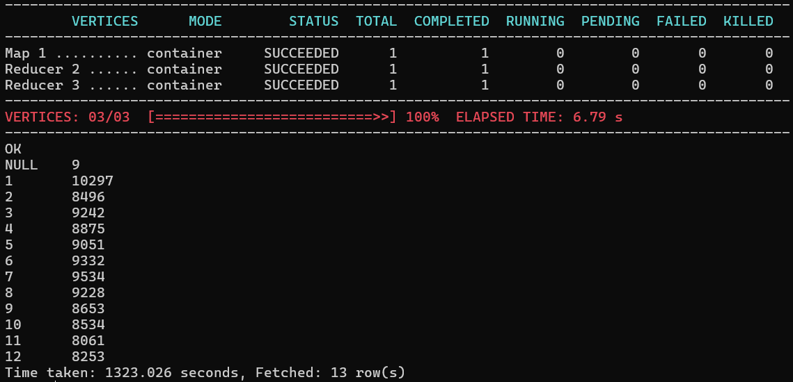

## Домашние задание по Hive

### Задание

- Создать внешнюю таблицу на данных coreDemography.
- Прогрузить в табличку данные из  hadoop2.zip/data2/coreDemography (https://cloud.mail.ru/public/pjfG/hhdHLfiJ6). Папка сoreDemography содержат данные демографии пользователей ОК. В  info.txt - описание полей.
- Написать запрос рассчитывающий распределение дней рождения по месяцам. В результате должна получится таблица из двух колонок (month, cnt).

### Решение

#### Перенос данных

``` input
hdfs dfs -copyFromLocal ./hadoop2/data2 /home/$USER/data
```

#### Создание базы данных

```SQL
create database user_a_marchenko
location '/home/a.marchenko/warehouse/';
```
#### Создание таблицы

``` SQL
use user_a_marchenko;
Create external table Demography (
id int, 
create_date int,
birth_date int, 
gender int,
id_country int, 
id_location int,
login_region int)
row format delimited
FIELDS TERMINATED BY '\t'
stored as textfile
location '/home/a.marchenko/data/data2/ok/coreDemography';
```

#### Запрос на распределение дней рождения по месяцам

``` SQL
SELECT MONTH(date_add('1970-01-01', birth_date)) AS month,
       COUNT(*) AS cnt
FROM Demography
GROUP BY MONTH(date_add('1970-01-01', birth_date))
ORDER BY month;
```

#### Результат выполнения
